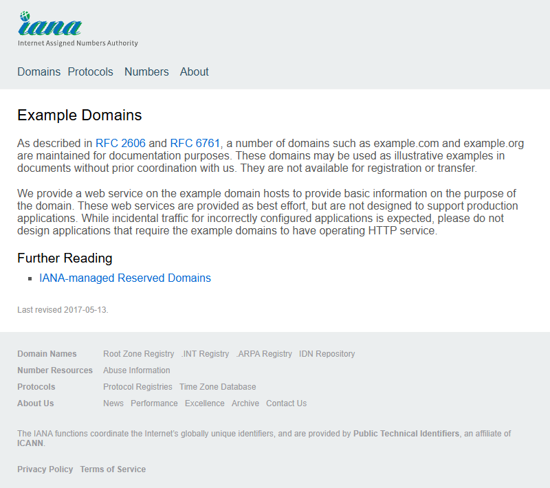
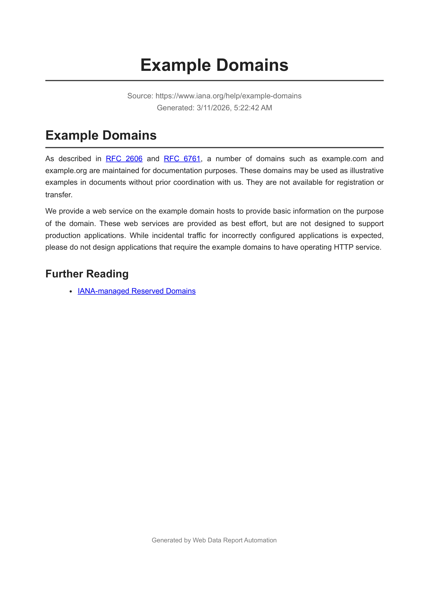

# Web Data Report Automation
> โปรเจคนี้ผมทำขึ้นเพื่อศึกษาการทำ Web Automation โดยเน้นการศึกษาการใช้งาน Puppeteer ให้ดึงความสามารถที่ Puppeteer ทำได้ออกมาเป็น Project สักตัว เช่น การประยุกต์ใช้ในการส่งออก PDF หรือการนำมาดึงข้อมูลในหน้าเว็บต่างๆอัตโนมัติ

## 📌 Concept
ระบบดึงข้อมูลจากหน้าเว็บ และสร้างรายงาน PDF พร้อม ScreenShot บันทึกภาพหน้าเว็บ ณ เวลาที่ดึงข้อมูลไว้ ซึ่งสามารถนำไปต่อยอดในงาน Web Monitoring, Dashboard Logging และการเก็บข้อมูลเพื่อวิเคราะห์ในอนาคต

## 🎯 Use Cases
- Web Monitoring
- Automated Report Generation
- Dashboard Archiving
- Website Evidence Collection

---

## 📸 Screenshots
| Original Website | Generated PDF Report |
|------------------|----------------------|
|  |  |

---

## 🏗️ Architecture
```text
User Input (URL)
        ↓
┌────────────────────┐
│  Scraper Module    │  <- ดึงข้อมูลเว็บ
│  (Puppeteer)       │
└────────────────────┘
        ↓
Structured Data (JSON)
        ↓
┌────────────────────┐
│  Manage HTML       │  <- สร้างรายงาน HTML
│  (Template Engine) │
└────────────────────┘
        ↓
    Rendered HTML
        ↓
┌────────────────────┐
│  PDF Generator     │  <- แปลง HTML เป็น PDF
│  (Puppeteer Print) │
└────────────────────┘
        ↓
     PDF Report
        ↓
┌────────────────────┐
│ Screenshot Module  │  <- แคปภาพหน้าเว็บ
│  (Visual Capture)  │
└────────────────────┘
        ↓
  Screenshots image
```

---

## 📂 Project Structure
<details>
  <summary>คลิกเพื่อดูโครงสร้างโปรเจค (Project Structure)</summary>

```text
web-data-report-automation/
│
├─ resource/
│
├─ src/
│   ├─ scraper.js          # ดึงข้อมูลข้อความ
│   ├─ screenshot.js       # แคปภาพหน้าเว็บ
│   ├─ manageHTML.js       # สร้าง HTML รายงาน
│   ├─ pdfGenerator.js     # แปลง HTML เป็น PDF
│   └─ index.js            # ควบคุม workflow
│
├─ templates/
│   └─ report.html         # เทมเพลตรายงาน
│
├─ output/
│   ├─ screenshots/        # ไฟล์ภาพหลักฐาน
│   └─ reports/            # ไฟล์รายงาน PDF
```

</details>

---

## ✨ Key Features
- **Web Scraping:** ระบบดึงข้อมูลเว็บไซต์อัตโนมัติด้วย Puppeteer เป็นรูปแบบ JSON ที่นำไปใช้งานต่อได้
- **Full-page Screenshot:** แคปภาพหน้าเว็บไซต์แบบเต็มหน้าเพื่อใช้เป็นหลักฐานประกอบรายงาน
- **PDF Export:** สร้างรายงานอัตโนมัติด้วยเทมเพลต HTML และแปลงเป็นไฟล์ PDF

---

## 🛠️ Tech Stack
- **Runtime:** Node.js  
- **Automation:** Puppeteer  
- **Frontend Template:** HTML5, CSS3  
- **Language:** JavaScript (Vanilla)
---

## 🚀 How to Run
### 1) ติดตั้ง Dependencies

```bash
npm install
```

---

### 2) รันโปรแกรม

```bash
node src/index.js
```

---

### 3) ผลลัพธ์ที่ได้

* 📄 รายงาน PDF `output/reports/`
* 📸 ภาพหน้าจอเว็บไซต์ `output/screenshots/`

---

ถ้าต้องการระบุ URL เอง:

```bash
node src/index.js https://example.com
```

---
